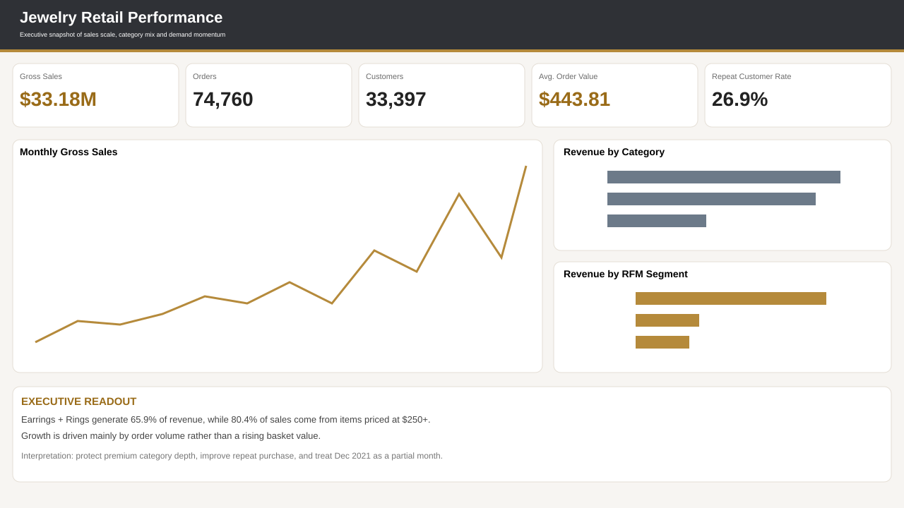
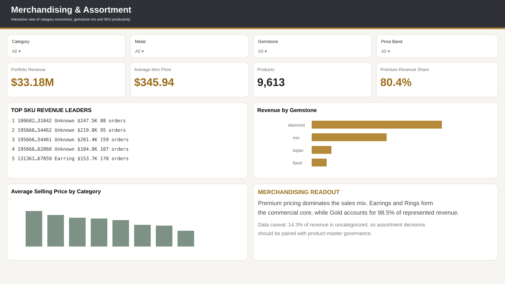
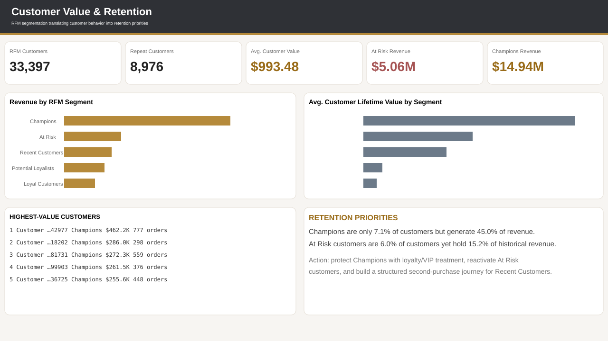
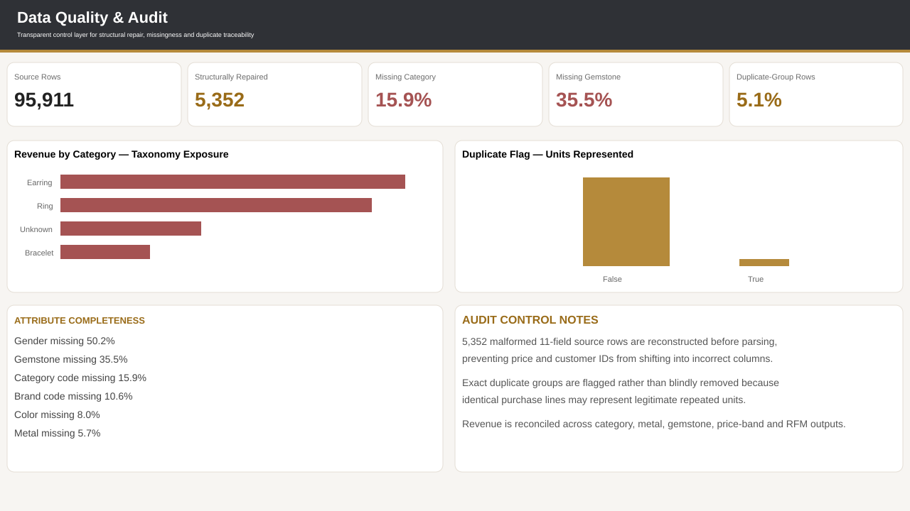

# Jewelry Retail Analytics

End-to-end **SQL + Python + Power BI** portfolio project transforming messy jewelry e-commerce purchase history into decision-ready sales, merchandising, customer-retention, and data-quality insights.



## Project at a Glance

| Metric | Result |
|---|---:|
| Transaction lines | **95,911** |
| Orders | **74,760** |
| Customers | **33,397** |
| Products | **9,613** |
| Gross sales represented | **$33.18M** |
| Average order value | **$443.81** |
| Repeat customers | **8,976** |
| Repeat customer rate | **26.88%** |

The completed Power BI report contains four pages: **Executive Overview**, **Product & Merchandising**, **Customer & Retention**, and **Data Quality & Audit**. The validated Desktop artifact is `Maryam_Jewelry_Portfolio_FINAL.pbix`. The PBIX binary is kept outside version control; this repository contains the reproducible pipeline, validated Power BI input tables, SQL analytical layer, documentation, and lightweight dashboard previews.

## Key Business Findings

- **Earrings + Rings generate 65.93% of revenue**, making them the commercial center of the category mix.
- **Gold represents 98.54% of revenue**; diamond products contribute **44.81%**.
- **80.42% of revenue comes from items priced at $250+**, indicating a strongly premium sales mix.
- Only **26.88% of customers are repeat buyers**, making retention a major growth opportunity.
- **Champions are 7.07% of customers but generate 45.03% of revenue**.
- **At Risk customers are 5.97% of customers but represent 15.24% of historical revenue**, creating a high-value reactivation opportunity.
- **5,352 source rows contain 11 physical fields instead of 13**; the Python ingestion layer reconstructs the missing positions before parsing so downstream fields do not shift into the wrong columns.
- Product-master completeness is material: category code is missing on **15.94%** of rows and gemstone on **35.51%**.

See [`docs/findings.md`](docs/findings.md) for the full business interpretation and recommendations.

## Power BI Portfolio Pages

| Executive Overview | Merchandising & Assortment |
|---|---|
|  |  |
| **Customer Value & Retention** | **Data Quality & Audit** |
|  |  |

The report uses a restrained charcoal, warm-white, muted-gold, sage, slate, and risk-red visual system so the work reads as **business intelligence and retail analytics**, not as a consumer jewelry advertisement.

## Analytical Workflow

```text
Kaggle source: jewelry.csv
        │
        ▼
Python structural repair + validation
        │
        ├──► Clean transaction fact table
        ├──► Customer RFM snapshot
        └──► Curated analytical outputs
        │
        ▼
SQL Server analytical layer
        │
        ▼
Power BI
        ├──► Executive performance
        ├──► Merchandising & assortment
        ├──► Customer value & retention
        └──► Data quality & audit
```

## Why the Data Preparation Matters

The source snapshot contains two physical record layouts:

- **90,559** standard 13-field rows
- **5,352** irregular 11-field rows

In the short-row layout, `category_code` and `brand` are absent. A naive CSV import can shift `price`, `user_id`, and downstream attributes into the wrong columns. [`python/01_prepare_data.py`](python/01_prepare_data.py) repairs the record structure **before** pandas parsing and type conversion.

Exact duplicate groups are **flagged rather than blindly deleted** because identical purchase lines may be either duplicate data or legitimate repeated units when no authoritative line key exists.

## Technical Scope

**Python** — defensive CSV ingestion, structural normalization, type validation, feature engineering, RFM segmentation, KPI generation, merchandising analysis, and cross-output reconciliation.

**SQL Server / T-SQL** — analytical schema design, indexes, data-quality audits, CTEs, window functions, customer-value analysis, RFM scoring aligned with the Python logic, merchandising queries, and Power BI-ready views.

**Power BI** — four-page executive report, validated KPI reporting, interactive merchandising analysis, full-history RFM storytelling, data-quality reporting, direct visual aggregations, and portfolio-grade visual hierarchy.

## Repository Structure

```text
jewelry-retail-analytics/
├── .github/workflows/sync-full-data.yml
├── data/
│   ├── jewelry_clean.csv
│   ├── customer_rfm.csv
│   └── sample_jewelry.csv
├── docs/
│   ├── data_dictionary.md
│   ├── methodology.md
│   └── findings.md
├── outputs/
│   ├── kpi_summary.csv
│   ├── annual_sales.csv
│   ├── monthly_sales.csv
│   ├── category_performance.csv
│   ├── metal_performance.csv
│   ├── gem_performance.csv
│   ├── price_band_performance.csv
│   ├── rfm_segment_summary.csv
│   ├── top_products.csv
│   ├── top_customers.csv
│   └── data_quality_summary.csv
├── powerbi/
│   ├── screenshots/
│   ├── README.md
│   ├── dashboard_blueprint.md
│   ├── dax_measures.md
│   ├── model_schema.md
│   ├── build_checklist.md
│   └── JewelryRetailAnalyticsTheme.json
├── python/
│   ├── 01_prepare_data.py
│   ├── 02_eda_rfm.py
│   └── 03_validate_outputs.py
├── sql/
│   ├── 01_create_table.sql
│   ├── 02_data_quality.sql
│   ├── 03_business_kpis.sql
│   ├── 04_customer_analysis.sql
│   ├── 05_merchandising_analysis.sql
│   └── 06_powerbi_views.sql
└── requirements.txt
```

## Reproduce the Analysis

```bash
pip install -r requirements.txt
```

Download the Kaggle source and save it as:

```text
data/raw/jewelry.csv
```

Run:

```bash
python python/01_prepare_data.py
python python/02_eda_rfm.py
python python/03_validate_outputs.py
```

The validation step reconciles represented revenue across the clean transaction table, category, metal, gemstone, price-band, and RFM outputs. For SQL Server, run the files under `sql/` in numeric order after importing the cleaned transaction table.

See [`powerbi/README.md`](powerbi/README.md) for the as-built report specification and [`powerbi/build_checklist.md`](powerbi/build_checklist.md) for the completed release QA record.

## Dataset

**Source:** *eCommerce Purchase History from Jewelry Store* — Michael Kechinov / REES46  
https://www.kaggle.com/datasets/mkechinov/ecommerce-purchase-history-from-jewelry-store

The raw Kaggle source is not committed. The repository **does include the validated cleaned Power BI input tables** (`data/jewelry_clean.csv` and `data/customer_rfm.csv`) plus curated analytical outputs so reviewers can inspect the actual results without reproducing the pipeline first.

## Interpretation Notes

- 2018 is a partial period in the analyzed snapshot.
- December 2021 contains only December 1 activity and is not a complete month.
- Revenue is not profit because cost and margin data are unavailable.
- Inventory, returns, promotions, traffic, and conversion data are not present.
- Missing product attributes constrain some assortment conclusions and are presented as a business finding rather than hidden through imputation.
- RFM segments are a **fixed full-history snapshot** relative to one day after the maximum observed transaction timestamp; they are not dynamically recalculated historical segments.
